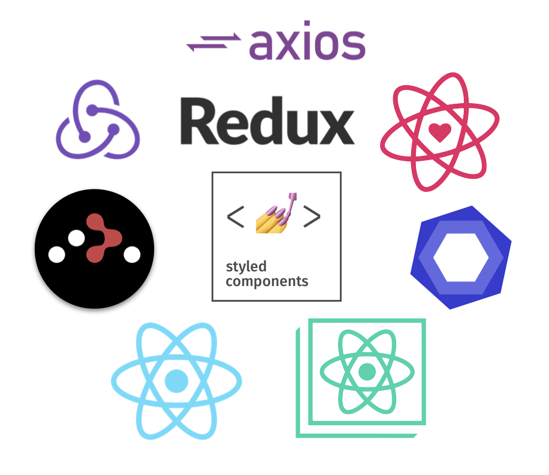

  
  <h3 align="center">csox</h3>
  

    交大資工考古題系統 | NCTU CS
     
     
    <a href="https://pastexam.csunion.nctu.me/">Visis Website</a>
    ·
    <a href="https://github.com/maxam2017/csox/issues">Report Bug</a>
    ·
    <a href="https://github.com/maxam2017/csox/issues">Request Feature</a>
  

### dependency

  

### changelog
> 

|timestamp|tag|description|
|:-:|:-:|-|
|2019.12/24|v2.0.0|mobile version |
|2019.11/23|v1.1.0|Transfer repo to [NCTUCSUnion / csox](https://github.com/NCTUCSUnion/csox)|
|2019.11/17 |-|Refactor [#7](https://github.com/maxam2017/csox/pull/7) [#8](https://github.com/maxam2017/csox/pull/8) 
|2019.11/04|v1.0.0 beta|beta版上線啦 